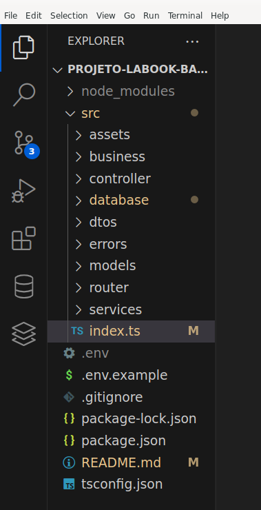

# Projeto Labook
O Labook é uma rede social com o objetivo de promover a conexão e interação entre pessoas. Quem se cadastrar no aplicativo poderá criar e curtir publicações.

#### Projeto backend em desenvolvimento 

# Conteúdos abordados
- NodeJS
- Typescript
- Express
- SQL e SQLite
- Knex
- POO
- Arquitetura em camadas
- Geração de UUID
- Geração de hashes
- Autenticação e autorização
- Roteamento
- Postman


# Funcionalidades 
- [Documentação](https://documenter.getpostman.com/view/26570634/2s9Y5VV4wk) Postman de todos os endpoints

- Endpoints
    - [ ]  signup
    - [ ]  login
    - [ ]  create post
    - [ ]  get posts
    - [ ]  edit post
    - [ ]  delete post
    - [ ]  like / dislike post

- Autenticação e autorização
    - [ ]  identificação UUID
    - [ ]  senhas hasheadas com Bcrypt
    - [ ]  tokens JWT
 
 - Código
    - [ ]  POO
    - [ ]  Arquitetura em camadas
    - [ ]  Roteadores no Express


### Estrutura das pastas


# Exemplos de requisição

## Signup
Endpoint público utilizado para cadastro. Devolve um token jwt.
```typescript
// request POST /users/signup
// body JSON
{
  "name": "Beltrana",
  "email": "beltrana@email.com",
  "password": "beltrana00"
}

// response
// status 201 CREATED
{
  token: "um token jwt"
}
```

## Login
Endpoint público utilizado para login. Devolve um token jwt.
```typescript
// request POST /users/login
// body JSON
{
  "email": "beltrana@email.com",
  "password": "beltrana00"
}

// response
// status 200 OK
{
  token: "um token jwt"
}
```


## Create post
Endpoint protegido, requer um token jwt para acessá-lo.
```typescript
// request POST /posts
// headers.authorization = "token jwt"
// body JSON
{
    "content": "Partiu happy hour!"
}

// response
// status 201 CREATED
``` 


## Get posts
Endpoint protegido, requer um token jwt para acessá-lo.
```typescript
// request GET /posts
// headers.authorization = "token jwt"

// response
// status 200 OK
[
    {
        "id": "uma uuid v4",
        "content": "Hoje vou estudar POO!",
        "likes": 2,
        "dislikes" 1,
        "createdAt": "2023-01-20T12:11:47:000Z"
        "updatedAt": "2023-01-20T12:11:47:000Z"
        "creator": {
            "id": "uma uuid v4",
            "name": "Fulano"
        }
    },
    {
        "id": "uma uuid v4",
        "content": "kkkkkkkkkrying",
        "likes": 0,
        "dislikes" 0,
        "createdAt": "2023-01-20T15:41:12:000Z"
        "updatedAt": "2023-01-20T15:49:55:000Z"
        "creator": {
            "id": "uma uuid v4",
            "name": "Ciclana"
        }
    }
]
```


## Edit post
Endpoint protegido, requer um token jwt para acessá-lo.<br>
Só quem criou o post pode editá-lo e somente o conteúdo pode ser editado.
```typescript
// request PUT /posts/:id
// headers.authorization = "token jwt"
// body JSON
{
    "content": "Partiu happy hour lá no point de sempre!"
}

// response
// status 200 OK
```

## Delete post
Endpoint protegido, requer um token jwt para acessá-lo.<br>
Só quem criou o post pode deletá-lo. Admins podem deletar o post de qualquer pessoa.
- garanta que ele continue funcionando depois de implementar o LIKE e DISLIKE!

```typescript
// request DELETE /posts/:id
// headers.authorization = "token jwt"

// response
// status 200 OK
```

## Like or dislike post (mesmo endpoint faz as duas coisas)

Endpoint protegido, requer um token jwt para acessá-lo.<br>
Quem criou o post não pode dar like ou dislike no mesmo.<br><br>
Caso dê um like em um post que já tenha dado like, o like é desfeito.<br>
Caso dê um dislike em um post que já tenha dado dislike, o dislike é desfeito.<br><br>
Caso dê um like em um post que tenha dado dislike, o like sobrescreve o dislike.<br>
Caso dê um dislike em um post que tenha dado like, o dislike sobrescreve o like.
### Like (funcionalidade 1)
```typescript
// request PUT /posts/:id/like
// headers.authorization = "token jwt"
// body JSON
{
    "like": true
}

// response
// status 200 OK
```

### Dislike (funcionalidade 2)
```typescript
// request PUT /posts/:id/like
// headers.authorization = "token jwt"
// body JSON
{
    "like": false
}

// response
// status 200 OK
```


